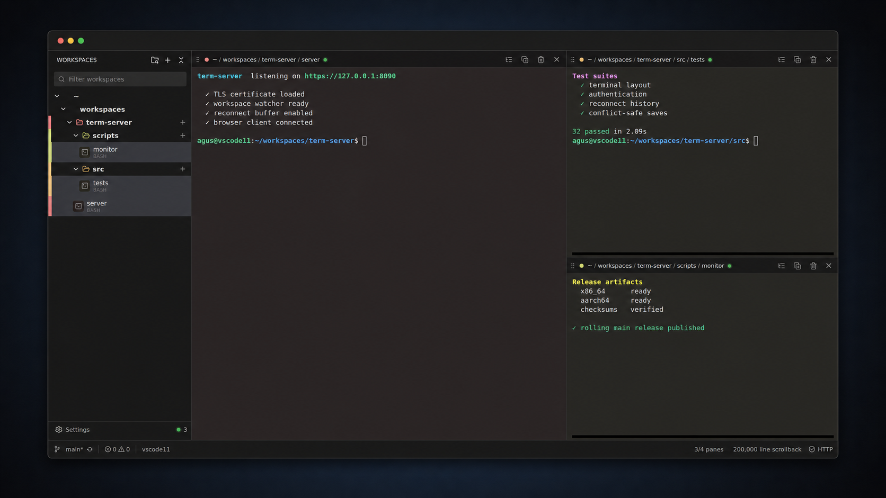
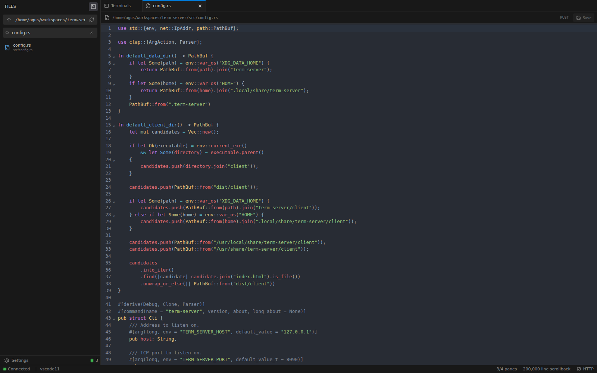
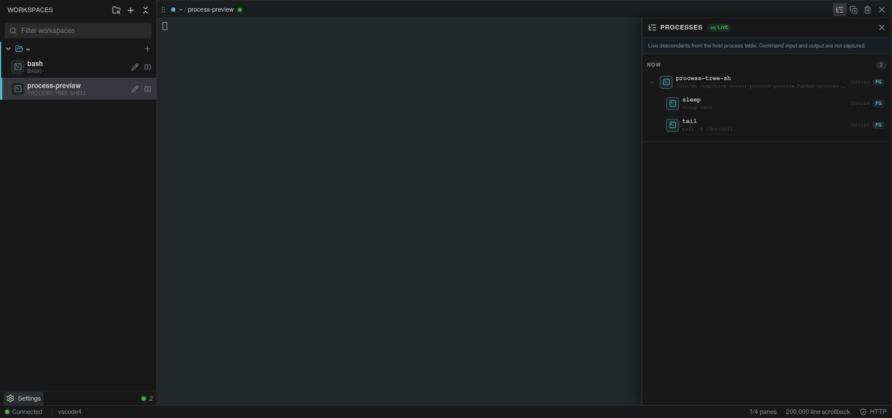
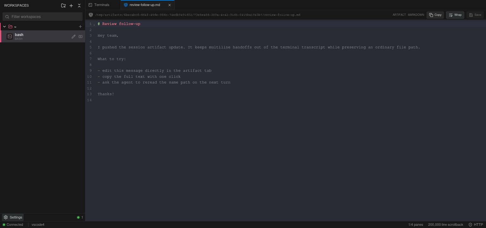

<div align="center">
  
  <h1>term-server</h1>
  <p><strong>A fast, secure terminal workspace that lives in your browser.</strong></p>
  <p>
    <a href="https://github.com/Agusx1211/term-server/actions/workflows/ci.yml"></a>
    
    
    <a href="LICENSE"></a>
  </p>
</div>



term-server is a small Rust daemon that keeps native PTYs alive and makes them available through a focused web interface. Terminals automatically follow their live working directories, so the sidebar becomes a workspace tree without any manual project setup. Split panes, reconnect history, a lightweight file editor, and a Linux process inspector are available when you need them; the product still feels like a terminal, not a browser IDE.

Sessions remain attached when a browser reloads or disconnects. They intentionally end when the term-server daemon stops.

## Install the latest build from `main`

Prebuilt Linux artifacts are available for x86-64 and ARM64. The installer detects the current architecture, downloads the rolling `main` release, verifies its SHA-256 checksum, and installs the binary and browser client for the current user.

```bash
curl -fsSL https://raw.githubusercontent.com/Agusx1211/term-server/main/install.sh | sh
~/.local/bin/term-server
```

The default locations are `~/.local/bin/term-server` and `~/.local/lib/term-server/client`. Override them with `TERM_SERVER_BIN_DIR` and `TERM_SERVER_INSTALL_DIR`. To inspect the installer before running it:

```bash
curl -fsSLO https://raw.githubusercontent.com/Agusx1211/term-server/main/install.sh
less install.sh
sh install.sh
```

`main` is a moving development channel. Pin a versioned release instead when stable releases become available.

On first boot, open `https://127.0.0.1:8090`. term-server prints a random password once and stores only its Argon2 hash. The browser will warn about the locally generated certificate; trust it, provide your own certificate, or terminate TLS at a reverse proxy.

## What it includes

- **Terminal-first workspace:** native PTYs, xterm.js WebGL rendering, truecolor, selection, clipboard shortcuts, search, links, up to eight panes, and as many as 2,000,000 scrollback lines per pane.
- **Phone and tablet support:** touch-sized navigation, a workspace drawer, focused pane switching, safe-area-aware layouts, and terminal actions that do not depend on hover or hardware-keyboard shortcuts.
- **Directory-aware organization:** terminals move between collapsible workspaces as their shell changes directory. Workspace colors, names, filters, and sidebar sizing stay stable across reconnects.
- **Resilient sessions:** bounded server-side replay, slow-client protection, coherent WebSocket reconnects, browser renderer caching, and a separate pane layout in each browser tab. A closed pane detaches the view without killing its process.
- **Files when needed:** searchable explorer, local image previews, and a lazy-loaded CodeMirror editor with syntax highlighting, atomic saves, and stale-file conflict detection.
- **Editable agent artifacts:** multiline messages, comments, prompts, and snippets can arrive as session-scoped tabs that are easy to inspect, copy, change, save, and revisit with the agent.
- **Process visibility:** a lightweight Linux `/proc` sampler shows the live descendant process tree and foreground job with secret-aware command-line redaction. It does not capture command input or output or retain exited processes.
- **Agent awareness:** Codex, Claude, and Pi sessions show working, idle, and closed states. An unseen return to idle gets a distinct bell until you focus that terminal. Optional browser notifications focus the relevant terminal when work completes.
- **Secure defaults:** loopback binding, HTTPS, Argon2 password hashing, signed HTTP-only SameSite cookies, origin enforcement, CSP, HSTS, login throttling, and bounded memory use.
- **Deployment choices:** one native daemon plus static browser assets, with Docker Compose and a systemd user service included.

## A closer look

<table>
  <tr>
    <td width="50%"></td>
    <td width="50%"></td>
  </tr>
  <tr>
    <td align="center"><strong>Explorer and conflict-safe editor</strong></td>
    <td align="center"><strong>Live process tree</strong></td>
  </tr>
</table>

The unframed workspace capture used for the hero is also available at [docs/screenshots/workspaces.png](docs/screenshots/workspaces.png).

## Everyday use

Click the main `+` to open a shell in your home directory, or use a workspace row’s `+` to start in that directory. A terminal’s name follows its foreground process until you pin a custom name. Click a terminal to open it in the active pane; use its split action or drag it onto the left, right, top, or bottom of another pane to build a nested layout.

On a phone, term-server keeps that pane layout but shows one terminal at a time. Use the arrows in the mobile toolbar to move between visible panes, the workspace drawer to open another session, and the terminal action menu for search, clipboard, process inspection, clone, kill, and close controls.

Closing a pane keeps the PTY running. The trash action kills it. A normal shell exit removes the terminal automatically.

### Install on a phone

Serve term-server from a trusted HTTPS origin, then open it in your phone's browser:

- On iPhone or iPad, use Safari's **Share → Add to Home Screen** action.
- On Android, use the browser menu's **Install app** or **Add to Home screen** action.

The installed app launches in its own standalone window and respects the device safe areas. Its interface assets are cached for resilient loading, but terminals, files, and authentication still require a connection to the term-server daemon. A browser warning bypass for the generated self-signed certificate may not qualify as a trusted origin; use a trusted certificate or TLS-terminating reverse proxy when installing from another device.

Useful shortcuts:

| Action | Shortcut |
| --- | --- |
| Copy selection | `Ctrl+Shift+C` / `Cmd+Shift+C` |
| Paste | `Ctrl+Shift+V` / `Cmd+Shift+V` |
| Search terminal history | `Ctrl+F` / `Cmd+F` |
| Save an edited file | `Ctrl+S` / `Cmd+S` |
| Open a local file link | `Ctrl+click` / `Cmd+click` |

Filesystem access has the same operating-system permissions as the daemon. Anyone who can sign in can also open a shell, so treat access as equivalent to SSH access for that user.

### Agent artifacts

The release installer makes the bundled `term-server-artifacts` Codex skill available in
`${CODEX_HOME:-~/.codex}/skills`. When an agent uses it from a term-server terminal, its helper
creates a private file under `/tmp/artifacts/<session>/<artifact-id>/` and prints both the full
`file://` URI and absolute path. Term-server discovers the file and opens it as an artifact tab;
the same path remains usable with normal tools such as `cat` in any other terminal.



Artifact tabs reuse the file editor, including conflict-safe saves, line wrapping, syntax
highlighting, and one-click copy. Edits are visible to the agent at the same path on later turns.
Artifacts are temporary: the operating system may clear `/tmp`, and they are not added to a
project or committed automatically.

For a source checkout, install the skill by linking it into Codex:

```bash
mkdir -p "${CODEX_HOME:-$HOME/.codex}/skills"
ln -s "$PWD/skills/term-server-artifacts" \
  "${CODEX_HOME:-$HOME/.codex}/skills/term-server-artifacts"
```

## Configuration

Run `term-server --help` for generated CLI help. CLI flags take precedence over environment variables.

| CLI | Environment | Default | Purpose |
| --- | --- | --- | --- |
| `--host` | `TERM_SERVER_HOST` | `127.0.0.1` | Bind address |
| `--port` | `TERM_SERVER_PORT` | `8090` | Listen port |
| `--no-https` | `TERM_SERVER_NO_HTTPS` | off | Disable built-in TLS |
| `--secure-cookie` | `TERM_SERVER_SECURE_COOKIE` | off | Mark cookies secure behind a TLS proxy |
| `--cert`, `--cert-key` | `TERM_SERVER_CERT`, `TERM_SERVER_CERT_KEY` | generated | Custom PEM certificate and key |
| `--tls-hostname` | `TERM_SERVER_TLS_HOSTNAMES` | local and bind hosts | Extra names for the generated certificate |
| `--password-file` | `TERM_SERVER_PASSWORD_FILE` | generated password | Read the password from a secret file |
| — | `TERM_SERVER_PASSWORD` | — | Password; takes precedence over the file |
| `--data-dir` | `TERM_SERVER_DATA_DIR` | `$XDG_DATA_HOME/term-server` | Credentials, TLS files, and settings |
| `--shell` | `TERM_SERVER_SHELL` | `$SHELL` | Default shell executable |
| `--allowed-origin` | `TERM_SERVER_ALLOWED_ORIGINS` | same origin | Extra reverse-proxy origins |
| `--replay-mb` | `TERM_SERVER_REPLAY_MB` | `16` | Reconnect buffer per terminal |
| `--scrollback-lines` | `TERM_SERVER_SCROLLBACK_LINES` | `200000` | Browser scrollback per pane |
| `--max-panes` | `TERM_SERVER_MAX_PANES` | `4` | Visible pane limit, 1–8 |
| `--client-dir` | `TERM_SERVER_CLIENT_DIR` | auto-detected | Compiled browser application |
| `--log` | `TERM_SERVER_LOG` | `term_server=info,tower_http=info` | Rust tracing filter |

For an unattended deployment, provide the password through the environment or a protected file:

```bash
TERM_SERVER_PASSWORD='use-a-long-random-secret' term-server
# or
term-server --password-file /run/secrets/term-server-password
```

Passwords stored in `credentials.json` can be changed from **Settings → Security**. Changing
the password signs out other browser sessions. Passwords supplied through the environment or a
secret file remain externally managed and must be changed at their source before restarting the
server.

Use `--no-https` only for local development or behind a trusted TLS-terminating proxy. When proxying, forward WebSocket upgrades and declare the public origin:

```bash
TERM_SERVER_ALLOWED_ORIGINS=https://terminal.example.com \
TERM_SERVER_SECURE_COOKIE=true \
  term-server --no-https --host 127.0.0.1
```

term-server does not trust forwarded client-IP headers. Keep the loopback listener private and apply public-network controls at the proxy or VPN.

## Docker

```bash
export TERM_SERVER_PASSWORD='use-a-long-random-secret'
docker compose up --build
```

The image runs as UID/GID `10001`. Bind-mounted projects must be readable by that user, and the data volume must be writable.

## systemd user service

After running the installer, install the supplied unit and create its protected environment file:

```bash
mkdir -p ~/.config/systemd/user ~/.config/term-server
curl -fsSL https://raw.githubusercontent.com/Agusx1211/term-server/main/deploy/term-server.service \
  -o ~/.config/systemd/user/term-server.service
printf 'TERM_SERVER_PASSWORD=%s\n' 'use-a-long-random-secret' > ~/.config/term-server/environment
chmod 600 ~/.config/term-server/environment
systemctl --user daemon-reload
systemctl --user enable --now term-server
```

The daemon finds Pi on its inherited `PATH` and in common per-user install locations, including npm, pnpm, Volta, Bun, asdf, mise, and installed NVM Node versions. Restart the service after installing or upgrading Pi.

Pi-generated titles and notification summaries have independent settings. A title is generated when an idle agent receives a new task; approvals and other input submitted while it is already working do not trigger another title request.

## Build from source

Prerequisites are Rust 1.88+, Node.js 22+, npm, and a C toolchain for the PTY dependency.

```bash
npm ci
npm run build
./target/release/term-server
```

For development, run the Rust API and Vite client together:

```bash
npm ci
npm run dev
```

Vite listens on `http://127.0.0.1:5173`, proxies the API on port 8090, uses the password `development`, and disables HTTPS. Do not expose the development server.

Before submitting a change:

```bash
npm run check
```

## Builds and release artifacts

[GitHub Actions](.github/workflows/ci.yml) formats, lints, type-checks, tests, and builds the project on every pull request and push to `main`. Native Ubuntu runners then produce self-contained archives for:

- `term-server-linux-x86_64.tar.gz`
- `term-server-linux-aarch64.tar.gz`

Each archive contains the native binary, compiled `client/`, README, license, and systemd unit. Successful `main` pushes update the rolling `main` prerelease and its `SHA256SUMS`; `install.sh` consumes exactly those assets. Build the current machine’s archive locally with `npm run package`.

## Architecture

Each terminal owns a native PTY, a bounded raw-output ring, and a Tokio broadcast channel. Dedicated blocking-reader threads keep PTY I/O away from the async Axum runtime. WebSocket subscribers receive a coherent replay before live output; lagging clients reconnect instead of allowing unbounded queues.

On Linux, one sampler reads `/proc` for all terminals every 1.5 seconds. It tracks the PTY foreground process group and recognizes supported agent process trees without parsing or delaying terminal bytes. Other operating systems retain normal terminal behavior but do not expose process and agent metadata.

The browser delegates terminal parsing and rendering to xterm.js. Recently viewed renderers remain mounted in a bounded cache so switching panes preserves the screen and scroll position without keeping every historical renderer alive.

## Security and privacy

Read [SECURITY.md](SECURITY.md) before exposing term-server beyond a trusted machine or network. Pi titles and completion summaries are independently disabled by default; enabling either sends a bounded, ANSI-sanitized slice of the relevant prompt or terminal output to the selected Pi model provider.

Please report vulnerabilities privately as described in the security policy. Contributions are welcome—see [CONTRIBUTING.md](CONTRIBUTING.md).

## License

[MIT](LICENSE) © 2026 term-server contributors.
