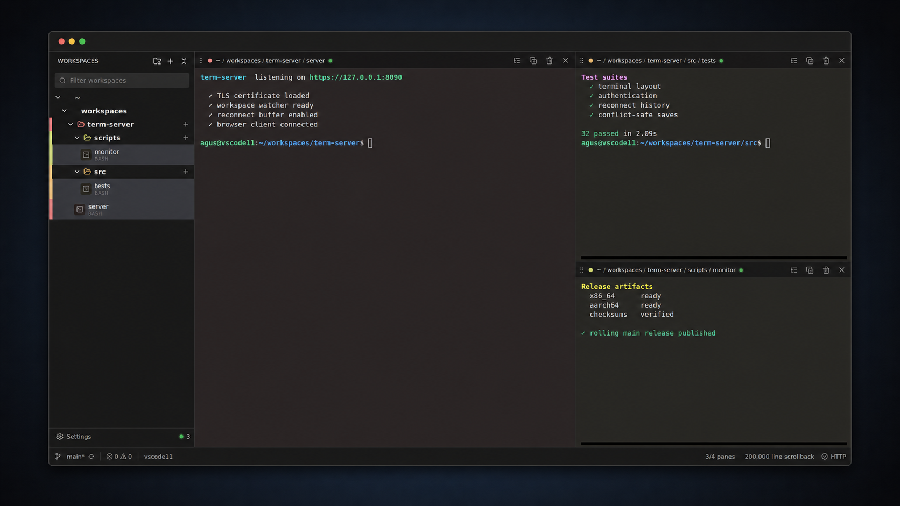
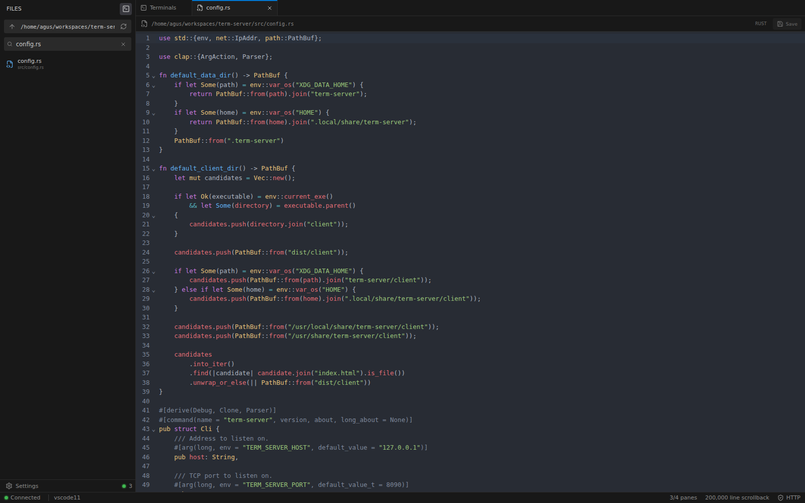
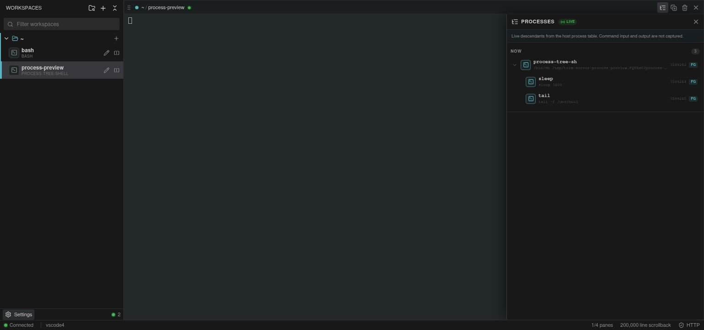
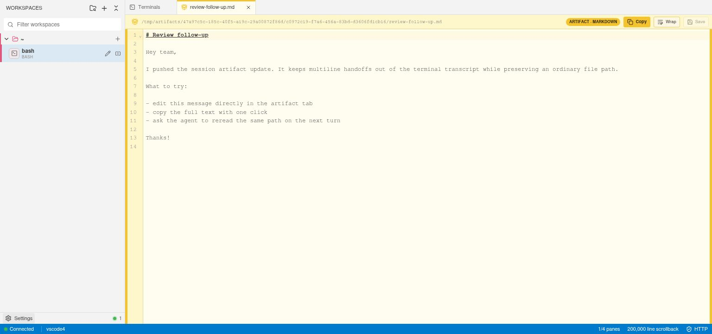

<div align="center">
  
  <h1>term-server</h1>
  <p><strong>A fast, secure terminal workspace that lives in your browser.</strong></p>
  <p>
    <a href="https://github.com/Agusx1211/term-server/actions/workflows/ci.yml"></a>
    
    
    <a href="LICENSE"></a>
  </p>
</div>



term-server is a small Rust service that keeps native PTYs alive and makes them available through a focused web interface. A private session broker owns the PTYs, while the HTTPS process can restart and reconnect to them. Terminals automatically follow their live working directories, so the sidebar becomes a workspace tree without any manual project setup. Split panes, reconnect history, a lightweight file editor, and a Linux process inspector are available when you need them; the product still feels like a terminal, not a browser IDE.

Sessions remain attached when a browser reloads, disconnects, or the HTTPS process applies a signed update. They intentionally end when the term-server service is explicitly stopped.

## Install the latest build from `main`

Prebuilt Linux artifacts are available for x86-64 and ARM64. The installer detects the current architecture, downloads the rolling `main` release, verifies the Ed25519 signature on its checksum list, verifies the selected archive's SHA-256 checksum, and installs the binary and browser client for the current user. `openssl` is required for signature verification.

```bash
curl -fsSL https://raw.githubusercontent.com/Agusx1211/term-server/main/install.sh | sh
~/.local/bin/term-server
```

To bootstrap the beta channel before the toggle is available locally:

```bash
curl -fsSL https://raw.githubusercontent.com/Agusx1211/term-server/main/install.sh \
  | TERM_SERVER_CHANNEL=beta sh
TERM_SERVER_UPDATE_CHANNEL=beta ~/.local/bin/term-server
```

After the first login, enable **Settings → Updates → Receive beta releases**; that persisted selection replaces the startup environment override.

The default locations are `~/.local/bin/term-server` and `~/.local/lib/term-server/client`. Override them with `TERM_SERVER_BIN_DIR` and `TERM_SERVER_INSTALL_DIR`. To inspect the installer before running it:

```bash
curl -fsSLO https://raw.githubusercontent.com/Agusx1211/term-server/main/install.sh
less install.sh
sh install.sh
```

`main` is the rolling current release. `beta` is a signed prerelease built from every successful `dev` push after the full browser and packaged-release gates pass. In **Settings → Updates**, enable **Receive beta releases** to follow `beta`; turn it off to return to `main`. The selection is stored in term-server's data directory and survives restarts. Explicit version channels such as `v1.2.3` remain pinned and cannot be changed from the toggle.

Installed releases check their selected channel after login and every six hours. When an update is available, the sidebar and **Settings → Updates** show an **Update** action. Updating verifies the signed release manifest, channel, target architecture, archive size and SHA-256 checksum, and the new binary's embedded version and source commit before replacing any files. The HTTPS process then restarts itself, keeps compatible older brokers available for their existing terminals, and starts the current broker for new terminals.

The broker is a hidden mode of the same executable. Brokers listen on generation-specific Unix sockets inside the data directory with user-only permissions and accept no network connections. An explicit service stop stops every broker and terminal; an in-process signed update leaves compatible brokers running. The broker protocol is versioned so future web processes can reject an incompatible handoff instead of silently corrupting a session.

Only the current broker accepts new terminals. Older compatible brokers drain until their final terminal closes, then stop automatically. Terminal headers identify sessions still running on an older build, and **Settings → Updates** lists active generations with an optional immediate restart. Restarting all brokers requires confirmation because it closes every open terminal.

Automatic installation is intentionally disabled for source builds, containers, and system packages whose binary and `client/` directory are not writable siblings. Those builds still expose their version and commit through `term-server --version`, the status bar, and the authenticated configuration API.

On first boot, open `https://127.0.0.1:8090`. term-server prints a random password once and stores only its Argon2 hash. The browser will warn about the locally generated certificate; trust it, provide your own certificate, or terminate TLS at a reverse proxy.

## What it includes

- **Terminal-first workspace:** native PTYs, code-server-aligned xterm.js WebGL rendering, truecolor, bundled Nerd Font symbols, Kitty keyboard input, OSC 52 clipboard support, selection, search, links, up to eight panes, and as many as 2,000,000 scrollback lines per pane.
- **Phone and tablet support:** touch-sized navigation, a workspace drawer, focused pane switching, safe-area-aware layouts, and terminal actions that do not depend on hover or hardware-keyboard shortcuts.
- **Directory-aware organization:** terminals move between collapsible workspaces as their shell changes directory. Workspace colors, names, filters, and sidebar sizing stay stable across reconnects.
- **Resilient sessions:** xterm-authored recovery checkpoints with a bounded server fallback, resize-safe sequenced resumption, in-place slow-client recovery, browser renderer caching, and a separate pane layout in each browser tab. A closed pane detaches the view without killing its process.
- **Files when needed:** searchable explorer, local image and PDF previews, direct downloads, and a lazy-loaded CodeMirror editor with syntax highlighting, atomic saves, and stale-file conflict detection.
- **Agent-connected artifacts:** multiline handoffs stay attached to the terminal and agent that created them, with inline text, image, and PDF previews plus an optional full editor.
- **Process visibility and control:** a lightweight Linux `/proc` sampler shows the complete live descendant process tree, foreground job, CPU and memory usage, and lets you send SIGTERM to a selected process. Command lines are secret-aware and redacted; input, output, and exited processes are not retained.
- **Terminal-scoped access approvals:** each terminal has one Access panel for secret requests, proactive in-memory secret grants, revocation, activity, and reviewed local sudo commands. Secret values never return to the browser or agent; sudo requires the user's password for the immutable command shown in the panel.
- **Agent awareness:** Codex, Claude, Pi, OMP, and Hermes sessions show working, blocked, idle, and closed states. An agent waiting on an approval or a question is marked **Needs you** for as long as it waits, so a stalled agent is visible without opening it. An unseen return to idle gets a distinct bell until you focus that terminal. Alerts can appear in-app, as desktop notifications, in both places, or remain off. In-app cards inherit their terminal color and can be placed in any corner with a configurable dismissal time.
- **Supervisor terminal:** one visibly marked, singleton terminal can inspect and control the other term-server sessions without embedding an AI provider into the server. Run OMP, Pi, Codex, Claude, or an ordinary shell command yourself; only descendants of that supervisor receive the embedded skill and scoped control tools. The tools expose terminal screens, input, names, process trees, creation and termination, plus open-tab listing and closure. They deliberately provide no project organizer, pane arranger, scheduler, or job system.
- **Secure defaults:** loopback binding, HTTPS, Argon2 password hashing, signed HTTP-only SameSite cookies, origin enforcement, CSP, HSTS, login throttling, and bounded memory use.
- **Deployment choices:** one native executable plus static browser assets, with Docker Compose and a systemd user service included.

## A closer look

<table>
  <tr>
    <td width="50%"></td>
    <td width="50%"></td>
  </tr>
  <tr>
    <td align="center"><strong>Explorer and conflict-safe editor</strong></td>
    <td align="center"><strong>Live process tree</strong></td>
  </tr>
</table>

The unframed workspace capture used for the hero is also available at [docs/screenshots/workspaces.png](docs/screenshots/workspaces.png).

## Everyday use

Click the main `+` to open a shell in your home directory, or use a workspace row’s `+` to start in that directory. A terminal’s name follows its foreground process until you pin a custom name. Click a terminal to open it in the active pane; use its row actions to rename, split, or kill it directly, or drag it onto the left, right, top, or bottom of another pane to build a nested layout. Kill actions ask for confirmation by default; turn off **Settings → Terminal behavior → Confirm before killing terminals** to make them immediate.

On a phone, term-server keeps that pane layout but shows one terminal at a time. Use the arrows in the mobile toolbar to move between visible panes, the workspace drawer to open another session, and the terminal action menu for search, clipboard, process inspection, clone, kill, and close controls. The touch keybar starts with terminal zoom controls; the percentage resets the text to its default size, and the selected size is remembered on that device.

Closing a pane keeps the PTY running. The trash action kills it. A normal shell exit removes the terminal automatically.

### Install on a phone

Serve term-server from a trusted HTTPS origin, then open it in your phone's browser:

- On iPhone or iPad, use Safari's **Share → Add to Home Screen** action.
- On Android, use the browser menu's **Install app** or **Add to Home screen** action.

The installed app launches as **`<hostname> Term Server`** in its own standalone window and respects the device safe areas. It loads the current interface from the daemon instead of keeping an offline app shell, so a server update cannot strand the installed app on an incompatible client. Upgrading from an older release clears that legacy app-shell cache automatically. Terminals, files, and authentication require a connection to the term-server daemon. A browser warning bypass for the generated self-signed certificate may not qualify as a trusted origin; use a trusted certificate or TLS-terminating reverse proxy when installing from another device.

Useful shortcuts:

| Action | Shortcut |
| --- | --- |
| Copy selection | `Ctrl+Shift+C` / `Cmd+Shift+C` |
| Paste | `Ctrl+Shift+V` / `Cmd+Shift+V` |
| Search terminal history | `Ctrl+F` / `Cmd+F` |
| Save an edited file | `Ctrl+S` / `Cmd+S` |
| Open a local file link | `Ctrl+click` / `Cmd+click` |

Filesystem access has the same operating-system permissions as the daemon. Anyone who can sign in can also open a shell, so treat access as equivalent to SSH access for that user.

### Agent artifacts

Term-server ships the canonical `term-server-artifacts` skill with every release. The installer
links it into `${CODEX_HOME:-~/.codex}/skills`, and **Settings → Artifact skill** reports whether
Codex, Claude Code, and Pi use that bundled version, another matching copy, an outdated copy, or a
broken link. Explicit install and repair actions link an agent to the bundled skill; term-server
never replaces a standalone directory. Managed links automatically follow term-server updates.

When an agent uses the skill from a term-server terminal, its helper creates a private file under
`/tmp/artifacts/<session>/<artifact-id>/` and prints both the full `file://` URI and absolute path.
Term-server discovers the completed file atomically and places it in that session's artifact
sidebar. Workspace rows and terminal headers show how many artifacts belong to each agent, and the
same path remains usable with normal tools such as `cat`.



The sidebar shows the selected artifact's contents next to the live terminal, including inline
text, image, and PDF previews. Open an artifact when the full conflict-safe editor, syntax
highlighting, line wrapping, or a larger canvas is useful. The editor links back to the originating
agent, and closing its tab leaves the artifact available in the sidebar without reopening it.
Edits remain visible to the agent at the same path on later turns. Delete actions in the sidebar and
full editor permanently remove the artifact and close any open tab after confirmation. Artifacts are
temporary: the operating system may clear `/tmp`, and they are not added to a project or committed
automatically.

For a source checkout, install the skill by linking it into Codex:

```bash
mkdir -p "${CODEX_HOME:-$HOME/.codex}/skills"
ln -s "$PWD/skills/term-server-artifacts" \
  "${CODEX_HOME:-$HOME/.codex}/skills/term-server-artifacts"
```

### Terminal access approvals

The terminal header's shield opens an Access panel scoped to that terminal. It shows pending secret
and sudo requests, active secret grants, use metadata, and recent decisions. A user can also add a
secret before an agent asks for it. Values remain only in the owning session broker's memory and are
revoked when requested, when the terminal exits, or when that broker stops; they are never returned
by the API.

Managed live-agent integrations include the bundled `term-server-access` skill. Inside a term-server
terminal, an agent requests a value, lists available names, and runs an exact command through the
broker without receiving the value:

```bash
"$TERM_SERVER_EXECUTABLE" access secret request \
  --name SERVICE_API_KEY --description "Publish the staging artifact" --agent omp
"$TERM_SERVER_EXECUTABLE" access secret list --agent omp
"$TERM_SERVER_EXECUTABLE" access secret run \
  --name SERVICE_API_KEY --env SERVICE_API_KEY --agent omp -- /usr/bin/command argument...
```

`--stdin` replaces `--env NAME` only for commands that explicitly consume a credential on standard
input. Secret commands are launched without shell interpretation in a minimal allowlisted
environment. Exact secret occurrences in combined output are redacted on a best-effort basis.

A local root command is submitted without a leading `sudo`:

```bash
"$TERM_SERVER_EXECUTABLE" access sudo \
  --description "Install the package needed for this task" --agent omp \
  -- /usr/bin/apt-get install -y package-name
```

The panel displays the exact argument vector, working directory, fingerprint, purpose, requester,
and waiter count. Approval requires HTTPS, a same-origin authenticated browser request, the current
request hash, and the user's sudo password. The password is never exposed to the agent, saved as a
secret grant, placed in command arguments or environment, or persisted by term-server.

The broker requires a root-owned executable that is not group- or world-writable, canonicalizes it,
binds its content and filesystem identity plus the working-directory identity into the request
fingerprint, and rechecks them immediately before invoking the reviewed target through `sudo`.
Command-specific sudoers rules continue to see the target executable rather than a term-server
wrapper.

### Live agent activity

Term-server continues to infer Codex, Claude Code, Pi, OMP, and Hermes state from their process trees,
terminal signals, output, and CPU activity. **Settings → Live agent activity** can additionally
install a small provider-native plugin or extension for more immediate lifecycle updates such as
thinking, running a command, waiting for approval, and compacting context. These updates appear in
the existing terminal subtitle; working, blocked, idle, ready, closed, and completion notifications
keep using the existing state machine.

### Supervisor terminal

Use the compact crown action in the workspace header to create or reopen the singleton supervisor. It is a normal persistent terminal: there is no provider chooser and closing its pane does not stop it. Creation requests time out instead of leaving the control busy indefinitely. Run `omp`, `pi`, `codex`, or `claude` as usual, or stay in the shell.

The terminal starts in a private managed directory containing provider-local instructions and the `term-server-supervisor` skill. Its `PATH` contains the matching control CLI, Codex and Claude receive invocation-local MCP configuration, OMP receives project-local MCP configuration, and Pi receives a project-local extension. Existing `HOME` and provider credential locations are left unchanged. Normal terminals receive none of this environment and cannot authenticate to the control socket.

The sidebar row and pane header turn amber when the shell leaves the managed supervisor directory, and the pane shows the exact root to return to before starting an agent. Subdirectories remain valid because provider skill discovery walks their ancestors.

The agent composes behavior from low-level primitives: list terminals and detected agents, read a rendered screen or bounded output tail, send text or named keys, create or rename a terminal, inspect or terminate a descendant process, and list or close open terminal panes and non-dirty resource tabs. Closing a pane leaves its PTY alive; killing a terminal ends it. There is no built-in “organize project,” layout-arrangement, delayed-action, scheduler, or job command.

### Blocked agents and screen detection

An agent waiting on a person is its own state. A permission prompt, a question, or a menu leaves the
agent **Needs you** until it is answered, separately from **Working** and **Idle**, and it stays
marked that way rather than being dismissed when you look at the terminal.

Three signals produce it. An installed integration reports an approval request directly. Codex's
`Action Required` window title reports it. And for agents whose hooks do not cover the whole
lifecycle, term-server matches the visible approval UI on the live screen against a per-agent
manifest of rules.

Those manifests are TOML rule sets scoped to structural regions of the screen — the prompt box, the
text below the last horizontal rule, the window title — rather than the whole screen, so transcript
text left over from an answered prompt cannot keep a terminal marked as waiting. Rules are
priority-ordered, a rule that recognizes an overlay such as a transcript viewer holds the last known
state instead of guessing, and an agent that matches nothing keeps its heuristic state rather than
being reported as blocked.

Manifests ship inside the binary. To change detection for one agent without waiting for a release,
drop a replacement at `~/.config/term-server/agent-detection/<agent>.toml`
(or under `$XDG_CONFIG_HOME`); an unreadable or invalid file is ignored with a warning and the
bundled rules stay in use. `GET /api/terminals/{id}/agent/explain` reports the screen the rules ran
against, which rule won, and how every rule evaluated, which is the fastest way to diagnose a
terminal showing the wrong state or to write an override.

The manifest format and the bundled Claude Code, Codex, Pi, and Hermes rule sets come from
[herdr](https://github.com/herdrdev/herdr) and are used under the Apache License 2.0; see
[`NOTICE`](NOTICE).

Ordinary foreground commands that keep running for at least five seconds also appear in terminal
rows and headers with an elapsed time. When they finish, they use the same unread badge and
completion notification preferences as agents. Foreground applications that enter the terminal's
alternate screen are treated as interactive TUIs instead: they stay marked **Live** without a
timer and disappear silently when they exit.

The managed packages are additive: they do not edit or replace existing hook files, and uninstalling
them removes only term-server's package and dedicated local marketplace. They do nothing outside a
term-server terminal. Native integrations forward lifecycle state plus a size-bounded semantic
thread of messages, tool activity/results, compaction markers, and status changes to the private
session broker. That retained thread may contain prompts, command text, tool arguments, tool output,
and model responses; it is available only through the capability-checked
`term-server-supervisor transcript` CLI. `scrollback` exposes the separately retained terminal output
as control-free text. Fallback inference remains enabled whether a package is installed, unavailable,
broken, or removed, and automatically takes over if a native update goes stale. Codex requires a
one-time review of newly installed hooks through `/hooks`; start a new agent session after any
package change.

## Configuration

Run `term-server --help` for generated CLI help. CLI flags take precedence over environment variables.

| CLI | Environment | Default | Purpose |
| --- | --- | --- | --- |
| `--host` | `TERM_SERVER_HOST` | `127.0.0.1` | Bind address |
| `--port` | `TERM_SERVER_PORT` | `8090` | Listen port |
| `--no-https` | `TERM_SERVER_NO_HTTPS` | off | Disable built-in TLS |
| `--secure-cookie` | `TERM_SERVER_SECURE_COOKIE` | off | Mark cookies secure behind a TLS proxy |
| `--cert`, `--cert-key` | `TERM_SERVER_CERT`, `TERM_SERVER_CERT_KEY` | generated | Custom PEM certificate and key |
| `--tls-hostname` | `TERM_SERVER_TLS_HOSTNAMES` | local and bind hosts | Extra names for the generated certificate |
| `--password-file` | `TERM_SERVER_PASSWORD_FILE` | generated password | Read the password from a secret file |
| — | `TERM_SERVER_PASSWORD` | — | Password; takes precedence over the file |
| `--data-dir` | `TERM_SERVER_DATA_DIR` | `$XDG_DATA_HOME/term-server` | Credentials, TLS files, and settings |
| `--status-config` | `TERM_SERVER_STATUS_CONFIG` | auto-configured | Optional version-1 TOML file for authenticated provider status modules |
| `--no-status-auto` | `TERM_SERVER_NO_STATUS_AUTO` | off | Disable automatic status-module configuration from local agent credentials |
| `--shell` | `TERM_SERVER_SHELL` | `$SHELL` | Default shell executable |
| `--allowed-origin` | `TERM_SERVER_ALLOWED_ORIGINS` | same origin | Extra reverse-proxy origins |
| `--replay-mb` | `TERM_SERVER_REPLAY_MB` | `64` | Canonical reconnect state and recent output per terminal |
| `--scrollback-lines` | `TERM_SERVER_SCROLLBACK_LINES` | `200000` | Browser scrollback per pane |
| `--max-panes` | `TERM_SERVER_MAX_PANES` | `4` | Visible pane limit, 1–8 |
| `--cached-terminals` | `TERM_SERVER_CACHED_TERMINALS` | `16` | Mounted terminal renderers per browser tab; `0` keeps only visible panes |
| `--client-dir` | `TERM_SERVER_CLIENT_DIR` | auto-detected | Compiled browser application |
| `--disable-updates` | `TERM_SERVER_DISABLE_UPDATES` | off | Disable signed update checks and installation |
| `--update-channel` | `TERM_SERVER_UPDATE_CHANNEL` | `main` | Startup release channel; Settings persists `main`/`beta`, while version tags stay pinned |
| — | `TERM_SERVER_RELEASE_BASE_URL` | GitHub releases | Alternate HTTPS release base URL |
| `--log` | `TERM_SERVER_LOG` | `term_server=info,tower_http=info` | Rust tracing filter |

### Provider status modules

The provider-neutral status line is enabled by default. When neither
`--status-config` nor `TERM_SERVER_STATUS_CONFIG` is supplied, modules for
`claude`, `codex`, and `zai` are auto-configured: on every refresh the server
resolves a credential first from the usual environment variables and then from
the local agent credential stores — `~/.claude/.credentials.json`,
`$CODEX_HOME/auth.json` (default `~/.codex/auth.json`), `~/.pi/agent/auth.json`,
and `~/.omp/agent/auth.json` (the Oh My Pi root follows `PI_CONFIG_DIR`).
Expired OAuth tokens are skipped, providers without a discovered credential stay
hidden, and re-logins are picked up without a restart. Each module's detail
popover names its non-secret credential source. Pass `--no-status-auto` (or
`TERM_SERVER_NO_STATUS_AUTO=true`) to turn auto-configuration off entirely.

The settings screen has a "Status bar limits" card whose toggles persist in
`status-settings.json` inside the data directory: "Show limits in the status
bar" (on by default) gates the whole feature in every mode, and "Also show on
mobile" overrides the mobile default. They are also editable through the
authenticated `GET`/`PATCH /api/config/status-modules` endpoint.

An explicit TOML file replaces auto-configuration. The selected file is read at
startup; a missing, unreadable, malformed, or unsupported-version file fails
startup with a short secret-free error. As with the other options, an explicit
CLI value takes precedence over its environment value. Restart term-server
after changing the path, file, or provider environment.

The version-1 file is non-secret TOML. Its complete schema is:

```toml
version = 1
enabled = true
show_on_mobile = false

[defaults]
refresh_seconds = 300
timeout_seconds = 5

[[modules]]
id = "codex"
provider = "codex"
label = "Codex"
enabled = true

[[modules]]
id = "claude"
provider = "claude"
label = "Claude"
enabled = true

[[modules]]
id = "zai"
provider = "zai"
label = "Z.AI"
enabled = true
```

`version` is required and must be `1`. The top-level `enabled` and
`show_on_mobile` values default to `false`; module `enabled` defaults to `true`.
Modules with `enabled = false` are omitted from the runtime module list; the
top-level `enabled` flag controls the entire status line.
`refresh_seconds` defaults to `300` and accepts `1..=86400`; `timeout_seconds`
defaults to `5` and accepts `1..=60`. There may be at most 64 modules. Module
IDs are required, unique, at most 64 characters, and may contain only ASCII
letters, digits, `.`, `_`, and `-`; labels are at most 80 characters and
providers at most 32 characters. Matching admin modules may use
`project_id` or `workspace_id`, each at most 128 characters and containing only
ASCII letters, digits, `_`, and `-`. Configured order is retained. Unknown
TOML keys are rejected.

Every module requires `id`, `provider`, and `label`. Supported providers are
`codex`, `openai`, `anthropic` (also `claude`), and `zai`. Optional
provider-specific, non-secret fields are:

- `credential_env`: an allowlisted environment-variable **name**, not a
  credential value. Its allowlist depends on `provider` and `admin`; when it is
  present, the named variable is used without falling back to discovery.
- `admin`: defaults to `false`; it is valid only for `openai`, `anthropic`, or
  `claude` and selects the separate provider-admin credential.
- `project_id`: accepted only for `admin = true` OpenAI modules and selects the
  official project rate-limits endpoint.
- `workspace_id`: accepted only for `admin = true` Anthropic/Claude modules and
  selects the official workspace rate-limits endpoint. Workspace responses are
  overrides only: omitted or null limit types inherit organization settings and
  are not presented as complete effective limits.

There is no `base_url` field. Custom outbound URLs and dashboard/private
provider endpoints are intentionally out of scope.

#### Provider capabilities and credential discovery

The status line never performs model inference. Ordinary provider credential
presence only establishes configured state; the service does not make regular
model requests to obtain rate-limit headers.

| Provider/module | Credential discovery (highest precedence first) | Authoritative data currently shown |
| --- | --- | --- |
| `codex` | `CODEX_API_KEY`, `CODEX_ACCESS_TOKEN`, `OPENAI_API_KEY` | Configured-only with a warning that this service has no standalone Codex quota source. No private dashboard route is called. |
| `openai` | `CODEX_API_KEY`, `CODEX_ACCESS_TOKEN`, `OPENAI_API_KEY` | A normal credential is configured-only. With `admin = true`, `OPENAI_ADMIN_KEY`, and `project_id`, the official project rate-limits endpoint can show configured requests/minute and tokens/minute; these are limits, not remaining quota or billing balance. |
| `anthropic` / `claude` | `CLAUDE_CODE_OAUTH_TOKEN`, `ANTHROPIC_AUTH_TOKEN`, `ANTHROPIC_API_KEY` | Normal credentials are configured-only. With `admin = true` and `ANTHROPIC_ADMIN_KEY`, the official organization rate-limits endpoint can show configured limits; `workspace_id` selects the official workspace endpoint and reports workspace overrides (omitted/null values inherit organization settings). These are not remaining quota or billing balance. |
| `zai` | `ZAI_API_KEY` | Configured-only with an explicit warning that Z.AI publishes no standalone public quota endpoint used by this service. No dashboard scraping is performed. |

For `codex`, `openai`, and `zai`, a discovered normal credential is never
reused as an Anthropic/OpenAI admin credential. For an admin module, discovery
uses `OPENAI_ADMIN_KEY` or `ANTHROPIC_ADMIN_KEY` only; setting `credential_env`
to that corresponding allowlisted name is an explicit alternative. Admin
credentials are never auto-discovered by normal modules. Provider credential
values belong in the term-server parent process environment, never in this
TOML file.

#### Status API, refresh, and stale data

After authentication, the browser fetches the no-store endpoint
`GET /api/status-modules`. It returns this camelCase shape:

```text
{
  enabled: boolean,
  display: { showOnMobile: boolean },
  modules: [{
    id: string,
    label: string,
    provider: string,
    state: "ok" | "warn" | "error" | "unconfigured",
    primary: string | null,
    details: [{ label: string, value: string }],
    refresh: {
      updatedAt: number | null,
      nextAt: number | null,
      intervalSeconds: number,
      stale: boolean
    },
    error: { code: string, message: string, retryable: boolean } | null
  }],
  generatedAt: number
}
```

The timestamp fields are Unix seconds. A missing credential yields
`unconfigured` without a provider request. Configured-only providers yield
`warn` with `primary = "configured"` and a detail explaining that no
standalone quota source is available. Successful admin-limit reads yield
`ok` with `primary = "configured limits"`; they still describe configured
limits rather than remaining quota. A workspace admin response uses
`primary = "workspace overrides"` and does not fill omitted or null values
with an effective inherited limit. An initial provider failure is `error`.
When a later refresh fails after an `ok` or `warn` snapshot, the service keeps
the prior safe value, changes the module to `warn`, sets `refresh.stale` to
`true`, retains `updatedAt`, schedules the next refresh with bounded retry
backoff (starting at the larger of 5 seconds and the configured interval, then
doubling up to 300 seconds or that interval), and includes a fixed sanitized
error. Browser transport retries start at 2 seconds and cap at 30 seconds.

Snapshots are cached until the earliest module refresh (300 seconds by default),
and one server-side refresh lock deduplicates concurrent browser requests.
Due provider results retain configured order; at most eight upstream requests
run concurrently under a 60-second total refresh deadline. Unfinished modules
receive a retryable `refresh_deadline` error. Admin requests are also bounded
by `timeout_seconds` (5 seconds by default, 60 seconds maximum) and a 256 KiB
response limit. Normal provider modules do not make outbound calls. The
normalized error codes are `unsupported_provider`, `timeout`,
`upstream_unavailable`, `auth_failed`, `rate_limited`, `upstream_error`,
`refresh_deadline`, `response_too_large`, and `invalid_response`; messages
never contain provider response bodies, URLs, credentials, or authorization
headers.

On mobile, the existing footer stays hidden unless `show_on_mobile = true`.
When enabled, only the compact horizontally scrollable status-module row is
shown, with all 32px of controls reserved above the bottom safe-area inset;
the normal connection/host/build items remain desktop-only.

TOML-configured status credentials are read from term-server's startup
environment; auto-configured modules additionally re-read the local agent
credential files on each refresh. On Unix, the same-user session broker and
terminal children intentionally inherit the environment variables, so commands
run by that user may observe them. Credentials are not accepted from the
browser, written to this configuration, serialized in `/api/status-modules`, or
logged; browser/API/log isolation remains intact.

For an unattended deployment, provide the password through the environment or a protected file:

```bash
TERM_SERVER_PASSWORD='use-a-long-random-secret' term-server
# or
term-server --password-file /run/secrets/term-server-password
```

Passwords stored in `credentials.json` can be changed from **Settings → Security**. Changing
the password signs out other browser sessions. Passwords supplied through the environment or a
secret file remain externally managed and must be changed at their source before restarting the
server. A successful login creates a revocable 400-day browser session and offers the credential
to supported browser password managers; explicit logout or a password change still invalidates it.

Use `--no-https` only for local development or behind a trusted TLS-terminating proxy. When proxying, forward WebSocket upgrades and declare the public origin:

```bash
TERM_SERVER_ALLOWED_ORIGINS=https://terminal.example.com \
TERM_SERVER_SECURE_COOKIE=true \
  term-server --no-https --host 127.0.0.1
```

term-server does not trust forwarded client-IP headers. Keep the loopback listener private and apply public-network controls at the proxy or VPN.

## Docker

```bash
export TERM_SERVER_PASSWORD='use-a-long-random-secret'
export TERM_SERVER_BUILD_COMMIT="$(git rev-parse HEAD)"
docker compose up --build
```

The image runs as UID/GID `10001`. Bind-mounted projects must be readable by that user, and the data volume must be writable.
Container self-updates are disabled by its split, read-only image layout; rebuild the image to update it.

## systemd user service

After running the installer, install the supplied unit and create its protected environment file:

```bash
mkdir -p ~/.config/systemd/user ~/.config/term-server
curl -fsSL https://raw.githubusercontent.com/Agusx1211/term-server/main/deploy/term-server.service \
  -o ~/.config/systemd/user/term-server.service
printf 'TERM_SERVER_PASSWORD=%s\n' 'use-a-long-random-secret' > ~/.config/term-server/environment
chmod 600 ~/.config/term-server/environment
systemctl --user daemon-reload
systemctl --user enable --now term-server
```

The daemon finds Pi on its inherited `PATH` and in common per-user install locations, including npm, pnpm, Volta, Bun, asdf, mise, and installed NVM Node versions. Restart the service after installing or upgrading Pi.

Pi-generated titles and notification summaries have independent settings. A title is generated from the first task submitted to an idle agent and remains stable for that agent session. Follow-up tasks, approvals, and other later input do not replace it.

## Build from source

Prerequisites are Rust 1.88+, Node.js 22+, npm, and a C toolchain for the PTY dependency.

```bash
npm ci
npm run build
./target/release/term-server
```

For development, run the Rust API and Vite client together:

```bash
npm ci
npm run dev
```

Vite listens on `http://127.0.0.1:5173`, proxies the API on port 8090, uses the password `development`, and disables HTTPS. The API uses a fresh temporary data directory and isolated session broker for each run. Do not expose the development server.

Before submitting a change:

```bash
npm run check
```

## Builds and release artifacts

[GitHub Actions](.github/workflows/ci.yml) formats, lints, type-checks, tests, and builds the project on every pull request, push to `main`, and `v*` tag. Native Ubuntu runners embed the Cargo version and exact source commit, then produce self-contained archives for:

- `term-server-linux-x86_64.tar.gz`
- `term-server-linux-aarch64.tar.gz`

Each archive contains the native binary, compiled `client/`, README, license, and systemd unit. Successful `main` pushes update the rolling `main` prerelease, while a tag matching the Cargo version (for example `v0.1.0`) publishes a versioned release. Releases contain:

- the x86-64 and ARM64 archives
- `SHA256SUMS` and its raw Ed25519 signature
- `release-manifest.json` with the version, commit, channel, publication time, target, size, and checksum of each archive
- the manifest's raw Ed25519 signature

The signing private key lives only in the `RELEASE_SIGNING_KEY` GitHub Actions secret. Its public half is committed at [`release/public-key.txt`](release/public-key.txt) and embedded in the daemon and installer. Publishing fails closed when the secret is absent or does not match that public key. Build the current machine’s archive locally with `npm run package`.

## Architecture

Each terminal owns a native PTY, a bounded VT fallback model, a short sequenced output ring, and a Tokio broadcast channel. Dedicated blocking-reader threads keep PTY I/O away from the async Axum runtime. The web process maintains a terminal-to-broker map across compatible generations and proxies each renderer to the owning socket. Once xterm.js has settled, a renderer periodically contributes a bounded serialization from the official xterm addon. A newly mounted renderer receives the latest such checkpoint followed by the exact retained PTY bytes that came after it; before any browser has contributed one, it receives the compact canonical fallback. An existing renderer resumes from its last parser-committed byte only when its grid epoch still matches, so a resize missed while disconnected forces a safe snapshot. If a subscriber falls behind, the same WebSocket is resynchronized from the ring or a fresh snapshot instead of being disconnected.

Switching panes does not cost a resynchronization. A renderer that leaves the screen but stays mounted holds its WebSocket open and keeps parsing, giving up only its say in the negotiated terminal size until it is on screen again, so returning to it finds the buffer exactly as it was left. The replay budget behind that is split evenly between the sequenced ring and the canonical model: resuming from the ring preserves a pane's own scrollback, which is far deeper than any snapshot, so the ring is worth as much as the state it falls back to.

Output is flow-controlled the way VS Code's terminal is. A browser acknowledges bytes only after xterm.js has parsed them, and while a terminal has produced more unacknowledged output than the high watermark, its reader thread stops draining the PTY, so the writing process blocks rather than the browser falling behind. A full-screen TUI repaint is paced by the renderer instead of overrunning it.

The window is counted per terminal rather than per browser, which is VS Code's design and its tradeoff. When several browsers watch one terminal they acknowledge the same bytes, so the counter drains faster than it fills and the quickest browser decides when output resumes; a slower one still falls behind and recovers through the snapshot path, but no browser can throttle a terminal for the others. Preview panes attach as observers and are outside flow control entirely. A terminal with no browser attached is never paused, because output nobody will ever acknowledge must not block an agent working unattended.

On Linux, one sampler reads `/proc` for all terminals every 1.5 seconds. It follows parent PID relationships across the complete process table, tracks the PTY foreground process group and per-process CPU and resident memory, and recognizes supported agent process trees without parsing or delaying terminal bytes. Process termination revalidates the terminal ancestry and process start time before sending SIGTERM. Other operating systems retain normal terminal behavior but do not expose process and agent metadata.

Foreground command status combines that process-group identity with the canonical VT alternate-screen state. Short commands are ignored, pipelines remain one activity even when their leader exits, and any process group that enters the alternate screen remains classified as an interactive TUI until the whole group leaves the foreground.

The browser delegates terminal parsing and rendering to xterm.js. It commits resume positions and acknowledges output only after xterm.js has parsed the corresponding bytes, and suppresses terminal-generated replies while applying snapshots, so historical device queries cannot leak back into a live PTY. One designated browser responds to live device queries when several clients are attached. Recently viewed renderers remain mounted in a bounded cache so switching panes preserves the screen and scroll position without keeping every historical renderer alive.

## Security and privacy

Read [SECURITY.md](SECURITY.md) before exposing term-server beyond a trusted machine or network. Pi titles and completion summaries are independently disabled by default; enabling either sends a bounded, ANSI-sanitized slice of the relevant prompt or terminal output to the selected Pi model provider.

Please report vulnerabilities privately as described in the security policy. Contributions are welcome—see [CONTRIBUTING.md](CONTRIBUTING.md).

## License

[MIT](LICENSE) © 2026 term-server contributors.
